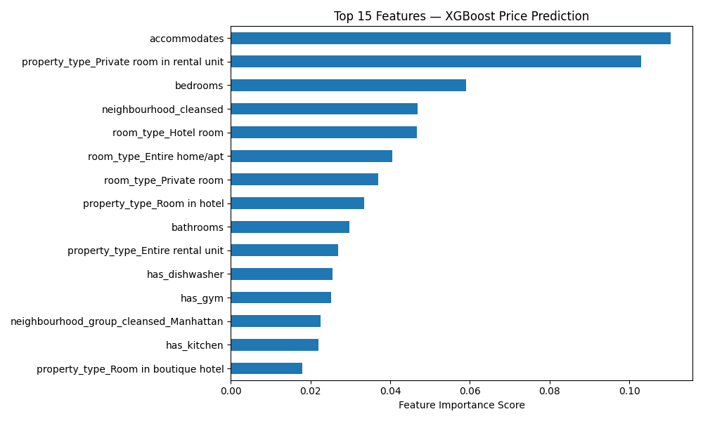
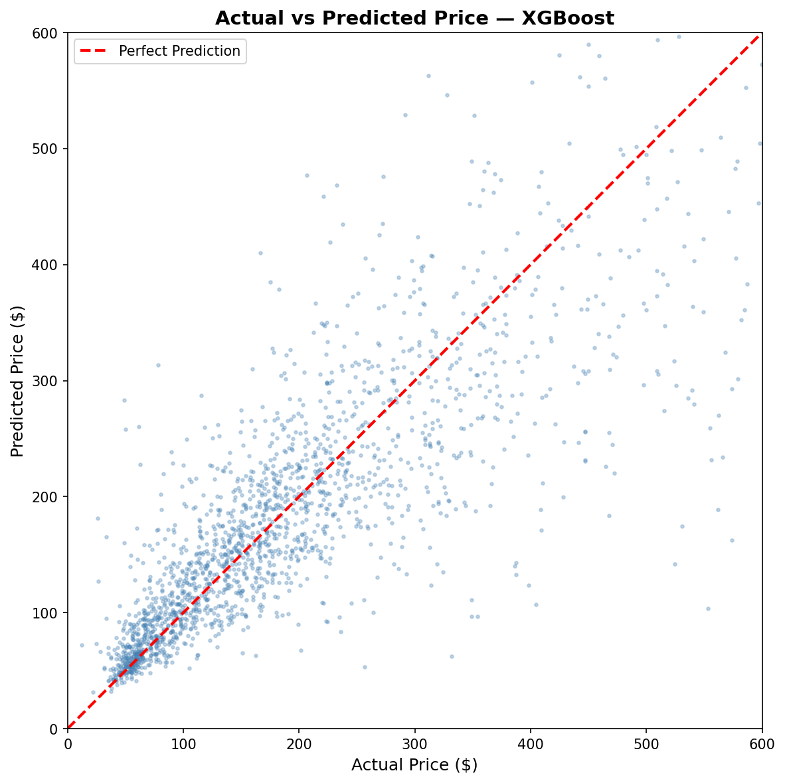

<div align="center">

# 🏙️ NYC Airbnb Price Prediction Pipeline

**End-to-end data engineering pipeline on 12M+ rows of NYC Airbnb data**  
*From raw messy CSVs → production-ready ML model in 7 notebooks*

[](https://python.org)
[](https://xgboost.readthedocs.io)
[](https://scikit-learn.org)
[](LICENSE)

</div>

---

## 🎯 What This Project Does

Takes three raw, messy Airbnb CSV files and builds a complete ML pipeline to predict nightly listing prices across New York City — cleaning 90 raw columns down to 45 engineered features, training three models, and achieving **76.3% R² with $192 average prediction error** on unseen data.

---

## 📊 Results — Current Best

| Model | Val R² | Test R² | Avg Dollar Error |
|-------|--------|---------|-----------------|
| Ridge Baseline | 0.629 | — | $246 |
| Random Forest | 0.720 | — | $247 |
| **XGBoost ✓** | **0.764** | **0.763** | **$192** |

> Trained on 16,416 listings · Validated on 2,052 · Tested on 2,053  
> Stratified 80/10/10 split by NYC borough · 45 training features

---

## 📈 Model Iteration History

This project went through three distinct versions. Each one is documented here honestly — including a leakage mistake that was caught and fixed.

### Version 1 — Leaked (inflated, incorrect)

| Model | Val R² | Test R² | Avg Dollar Error |
|-------|--------|---------|-----------------|
| Ridge Baseline | 0.913 | — | $1,014 |
| Random Forest | 0.988 | — | $148 |
| XGBoost | 0.988 | 0.991 | $114 |

**Why these scores were wrong:** `price_per_person` and `price_per_bedroom` were engineered from the target variable `price` and incorrectly kept in X. The model was mathematically reconstructing the answer — `price = price_per_bedroom × bedrooms` — rather than learning genuine price patterns from listing characteristics. R² of 0.991 is a red flag for any real-world regression problem.

---

### Version 2 — Leakage Fixed (honest baseline)

| Model | Val R² | Test R² | Avg Dollar Error |
|-------|--------|---------|-----------------|
| Ridge Baseline | 0.613 | — | $246 |
| Random Forest | 0.718 | — | $246 |
| **XGBoost** | **0.769** | **0.761** | **$189** |

**What changed:** Removed `price_per_person` and `price_per_bedroom` from X before splitting. The model now learns from genuine listing characteristics — size, location, room type, amenities, host experience — not from derived price ratios.

Val/test gap is only 0.008 — model generalizes cleanly with no overfitting.

---

### Version 3 — 6 New Engineered Features (current)

| Model | Val R² | Test R² | Avg Dollar Error |
|-------|--------|---------|-----------------|
| Ridge Baseline | 0.629 | — | $246 |
| Random Forest | 0.720 | — | $247 |
| **XGBoost** | **0.764** | **0.763** | **$192** |

**What was added:**

| Feature | Description | Reasoning |
|---------|-------------|-----------|
| `listing_age_years` | Days since first review ÷ 365 | Established listings command higher prices |
| `is_recently_active` | Reviewed in last 6 months (binary) | Freshness signals active, bookable listing |
| `reviews_per_year` | Review count ÷ listing age | Review velocity — popular listings get reviewed more |
| `bathrooms_per_guest` | Bathrooms ÷ accommodates | Normalized comfort ratio |
| `bedrooms_per_guest` | Bedrooms ÷ accommodates | Normalized space ratio |
| `amenity_density` | Amenity count ÷ accommodates | Amenities per person, not just total count |

**What happened:** Val R² moved from 0.769 → 0.764 (slight decrease) while Test R² moved from 0.761 → 0.763 (slight increase). The new features marginally hurt validation but marginally helped generalization — suggesting they add genuine signal but the model needs better hyperparameter tuning to extract full value from them. Hyperparameter tuning is the next step.

---

## ⚠️ Leakage Identified and Fixed

During self-review, I identified **target leakage** in Version 1.

`price_per_person` and `price_per_bedroom` were derived directly from the target variable `price` and incorrectly included in X — allowing the model to mathematically reconstruct the answer:

```
price_per_bedroom = price / bedrooms
→ price = price_per_bedroom × bedrooms   ← model just does this in reverse
```

**Fix:** Removed both columns from X in `05_ml_pipeline.ipynb` before splitting. They remain in the processed dataset for reference but are excluded from model training. Scores dropped from 0.991 → 0.761 — a more honest and useful number.

Identifying and fixing target leakage independently is one of the most important skills in real-world ML — it's one of the most common and dangerous mistakes in production pipelines.

---

## 🗺️ Feature Importance

Top features driving price predictions (Version 3 — current):



Key findings:
- `accommodates` — dominant signal, size matters most
- `bedrooms` — second strongest
- `neighbourhood_cleansed` — location (target encoded across 200+ neighbourhoods)
- `room_type_Entire home/apt` — entire homes command significant premium
- `property_type` — hotel rooms and rental units priced differently

---

## 📈 Model Performance



Points cluster tightly around the perfect prediction line especially in the $50–$250 range. Spread increases at higher prices — expected since luxury listings ($400+) are rarer and harder to generalize from.

---

## 🗂️ Project Structure

```
nyc-airbnb-price-predictor/
│
├── 📓 notebooks/
│   ├── 01_cleaning_listing_data.ipynb   # clean 90-column listings file
│   ├── 02_cleaning_reviews_data.ipynb   # aggregate 700k review rows
│   ├── 03_cleaning_calendar_data.ipynb  # aggregate 12M calendar rows
│   ├── 04_feature_engineering.ipynb     # merge, engineer 45 features, outlier capping
│   ├── 05_ml_pipeline.ipynb             # train/val/test split (leakage fix here)
│   ├── 06_ml_encoding.ipynb             # encoding, scaling, train 3 models (Colab)
│   └── 07_eda_plots.ipynb               # all visualizations
│
├── 📊 plots/
│   ├── 01_price_distribution.png        # before/after log transform
│   ├── 02_price_by_borough.png          # price by NYC borough
│   ├── 03_price_by_room_type.png        # entire home vs private room
│   ├── 04_price_map.png                 # geographic price heatmap
│   ├── 05_correlation_heatmap.png       # feature correlations
│   ├── 06_actual_vs_predicted.png       # model performance
│   └── feature_importance.png           # XGBoost top 15 features
│
├── 🤖 models/
│   └── xgboost_airbnb_model.pkl         # trained XGBoost model (2MB)
│
├── 📁 data/
│   ├── raw/                             # original CSVs (not in repo)
│   ├── processed/                       # cleaned intermediate files
│   └── output/                          # final train/val/test splits
│
├── .gitignore
├── requirements.txt
└── README.md
```

---

## 🔍 Pipeline Overview

```
Raw Data                    Cleaning                  Features
─────────                   ────────                  ────────
listings.csv.gz   ──►  drop 47 useless cols  ──►  host_experience_level
reviews.csv.gz    ──►  parse $1,200 → 1200   ──►  total_availability_score
calendar.csv.gz   ──►  fill nulls smartly    ──►  amenity binary flags (12)
                         fix t/f booleans         review_score_avg
35,036 listings   ──►  parse amenity JSON    ──►  listing_age_years
90 raw columns         IQR outlier capping        reviews_per_year
                                                  neighbourhood target enc.
                                                        │
                                                        ▼
                                              20,521 clean rows
                                              45 training features
                                                        │
                                              ┌─────────┼─────────┐
                                           Train      Val       Test
                                          16,416     2,052     2,053
                                                        │
                                              XGBoost Regressor
                                                        │
                                              R² = 0.763
                                           $192 avg error
```

---

## 🛠️ Key Challenges Solved

**1. Price column entirely NULL in latest scrape**
Inside Airbnb removed the static price column from recent datasets. Solved by extracting `price_per_night` from the `price_quote_raw` JSON blob in the new scrape format.

**2. 12M row calendar file**
Aggregated per listing using `groupby().agg()` — reducing 12M rows to one row per listing with `availability_rate` and `total_days`.

**3. Amenities stored as JSON-like strings**
`'["Wifi", "Kitchen", "TV"]'` parsed with `json.loads()` + loop to create 12 binary feature columns for high-signal amenities.

**4. neighbourhood_cleansed had 200+ unique values**
One-hot encoding would create 200+ columns. Used **target encoding** — replaced each neighbourhood with its mean `log_price` computed from the train set only, with global mean fallback for unseen neighbourhoods.

**5. Target leakage identified and fixed**
`price_per_person` and `price_per_bedroom` derived from target variable. Identified during self-review, removed before splitting. Scores corrected from 0.991 → 0.761.

**6. 99999 sentinel values in date features**
`days_since_first_review` used 99999 for listings with no reviews. Dividing by 365 naively gave 273-year-old listings. Fixed with conditional logic before engineering `listing_age_years` and `reviews_per_year`.

**7. Train/val/test leakage prevention**
All encoders and scalers fit exclusively on X_train. Target encoding computed from y_train only.

---

## 📦 Data

This project uses the [Inside Airbnb](http://insideairbnb.com/get-the-data/) dataset for **New York City** (April 2026 scrape).

To reproduce locally:

1. Go to http://insideairbnb.com/get-the-data/
2. Scroll to **New York City**
3. Download:
   - `listings.csv.gz` — Detailed listings data (~50MB)
   - `reviews.csv.gz` — Detailed review data
   - `calendar.csv.gz` — Daily availability data (~300MB)
4. Place all three in `data/raw/`

> Raw data files are not included in this repo due to file size.

---

## 🚀 How to Run

```bash
# 1. clone the repo
git clone https://github.com/master-zero1/nyc-airbnb-price-predictor.git
cd nyc-airbnb-price-predictor

# 2. install dependencies
pip install -r requirements.txt

# 3. download data (see above) and place in data/raw/

# 4. run notebooks in order (locally)
# 01 → 02 → 03 → 04 → 05

# 5. run 06_ml_encoding.ipynb in Google Colab for model training
# upload data/output/ CSVs to Colab session
```

---

## 🔮 Use the Trained Model

```python
import joblib
import numpy as np

model = joblib.load('models/xgboost_airbnb_model.pkl')

# model outputs log_price — convert back to dollars
prediction = model.predict(X_encoded)
price_dollars = np.expm1(prediction)
print(f"Predicted price: ${price_dollars[0]:.2f}/night")
```

---

## 📚 Tech Stack

| Tool | Purpose |
|------|---------|
| Pandas | Data loading, cleaning, transformation |
| NumPy | Numerical operations, log transforms |
| Scikit-learn | Encoding, scaling, Ridge, Random Forest |
| XGBoost | Final production model |
| Matplotlib | All visualizations |
| Joblib | Model serialization |

---

## 📖 What I Learned

- **Target leakage** is subtle and devastating — engineered features derived from the target variable inflate scores from 0.761 to 0.991. Always trace every feature back to its source before training.
- **Honest scores matter more than impressive scores** — a 0.763 R² you understand is worth more than a 0.991 you can't explain
- **IQR capping** preserves data while limiting damage from extreme values
- **Flag before filling** — null values in review scores carry information (no reviews ≠ bad reviews)
- **Target encoding** for high-cardinality categoricals avoids column explosion
- **Fit on train only** — the single most important rule in ML preprocessing
- **log transform** on skewed targets dramatically improves model learning
- **99999 sentinel values** in engineered features cause silent bugs — always inspect fill values before deriving new features from them

---

## 🔭 What's Next

- [x] Add 6 new engineered features
- [ ] Hyperparameter tuning with RandomizedSearchCV + GridSearchCV
- [ ] Build a Streamlit web app for live price predictions
- [ ] Add SHAP values for model explainability
- [ ] NLP sentiment analysis on review text (VADER — fast, rule-based)
- [ ] External data: NYC subway proximity using lat/lon

---

<div align="center">

**Built by [master-zero1](https://github.com/master-zero1)**  
*NYC Airbnb Data · April 2026 Scrape · XGBoost · R² = 0.763*

</div>